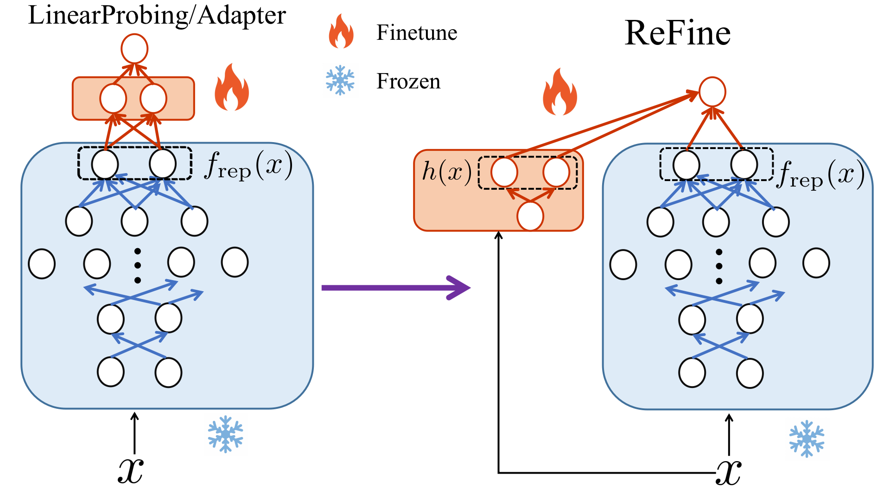

# REFINE

This repository contains code to reproduce the results from the manuscript **"REFINE: Residual Feature Integration is Sufficient to Prevent Negative Transfer."**



REFINE is a simple, modular, and multi-source-compatible approach that guarantees you never transfer worse than training from scratch. Despite its simplicity and comparable complexity, REFINE can outperform Adapter and Linear Probing in cross-domain transfer scenarios.


# Environment Configuration

We’re equipped with an NVIDIA A10 G (Ampere) GPU with 23 GB GDDR6, running driver 535.183.01 and CUDA 12.2

Use the following commands to set up the environment:

```bash
conda create --name refine python=3.10.16
conda activate refine
```

Then install dependencies using either:

```bash
pip install -r requirements.txt
```

or:

```bash
conda install --file environment.yml
```

Then make directory 

```bash
mkdir data
```

# Results 

We have stored our results for all experiments.

| Script Name                      | Results Location                                                                                                                       |
|----------------------------------|-----------------------------------------------------------------------------------------------------------------------------------------|
| `noise.py`                       | `./results_test10/noise_0.json`<br>`./results_test10/noise_0.4.json`<br>`./results_test10/noise_0.8.json`                               |
| `adversarial.py`                 | `./results_test10/adversarial.json`                                                                                                     |
| `imb.py`                         | `./results_test10/imb.json`                                                                                                             |
| `mismatch.py`                    | `./results_test10/mismatch.json`                                                                                                        |
| `noise_test100.py`               | `./results_test100/noise_0.json`<br>`./results_test100/noise_0.4.json`<br>`./results_test100/noise_0.8.json`                           |
| `adversarial_test100.py`         | `./results_test100/adversarial.json`                                                                                                    |
| `imb_test100.py`                 | `./results_test100/imb.json`                                                                                                            |
| `mismatch_test100.py`            | `./results_test100/mismatch.json`                                                                                                       |
| `noise_tf.py`                    | `./results_test10/noise_tf_0.json`<br>`./results_test10/noise_tf_0.4.json`<br>`./results_test10/noise_tf_0.8.json`                     |
| `mismatch_tf.py`                 | `./results_test10/mismatch_tf.json`                                                                                                     |
| `imb_tf.py`                      | `./results_test10/imb_tf.json`                                                                                                          |
| `adversarial_tf.py`              | `./results_test10/adversarial_tf.json`                                                                                                  |
| `noise_tf_test100.py`            | `./results_test100/noise_tf_0.json`<br>`./results_test100/noise_tf_0.4.json`<br>`./results_test100/noise_tf_0.8.json`                   |
| `mismatch_tf_test100.py`         | `./results_test100/mismatch_tf.json`                                                                                                    |
| `imb_tf_test100.py`              | `./results_test100/imb_tf.json`                                                                                                         |
| `adversarial_tf_test100.py`      | `./results_test100/adversarial_tf.json`                                                                                                 |
| `scaling_hard.py`                | `./results_ablate/scaling_hard.json`                                                                                                    |
| `scaling_oracle.py`              | `./results_ablate/scaling_oracle.json`                                                                                                  |
| `scaling_low_lr.py`              | `./results_ablate/scaling_low_lr.json`                                                                                                  |
| `scaling.py`                     | `./results_test10/scaling.json`                                                                                                         |
| `match_stl.py`                   | `./results/stl.json`                                                                                                                    |
| `match_digit.py`                 | `./results/usps_mnist_results.json`                                                                                                     |
| `match_domainnet.py`             | `./results/domainnet.json`                                                                                                              |
| `match_text.py`                  | `./results/text.json`                                                                                                                   |
| `match_text_elec.py`             | `./results/text_dvd2elec.json`                                                                                                          |
| `ablate_text.py`                 | `./results_ablate/ablate_adapters.json`                                                                                                 |


Most of json names are self-explaining. Both names `enahnced_concat` and `refine` are our proposed REFINE.


# Quick Test

You can easily test REFINE against others such as NoTrans (train from scratch), LinearProbing, Adapter, and Knowledge Distillation on CIFAR-10 with CNN when the pretrained data are challenging such as heavy label noise, semantic confusion, data imbalance, and domain mismatch by running

```
./run.sh
```

You can then refer to previous section to find the corresponding directory and json.


# Full Reproduction

This section guides you through fully reproducing all results. You can also uncomment the relevant chunks in `./run.sh` to run all experiments in batch mode.

For stress test (label noise, semantic confusion, data imbalance, domain mismatch) with CNN on CIFAR-10 and CIFAR-100:

```bash
python noise.py
python adversarial.py
python imb.py
python mismatch.py
python noise_test100.py
python adversarial_test100.py
python imb_test100.py
python mismatch_test100.py
```

For stress test with Transformer on CIFAR-10 and CIFAR-100:

```bash
python noise_tf.py
python mismatch_tf.py
python imb_tf.py
python adversarial_tf.py
python mismatch_tf_test100.py
python imb_tf_test100.py
python adversarial_tf_test100.py
python noise_tf_test100.py
```

For multi-source scaling experiments:

```bash
python scaling_hard.py
python scaling_oracle.py
python scaling_low_lr.py
python scaling.py
```

For ablation of parameter count in adapter implementation

```bash
python ablate_text.py
```

For cross-domain transfer experiments, please download the required datasets first.  
- For STL, the dataset will be downloaded automatically within the script.  
- For digit datasets (MNIST and USPS), simply run:
```bash
python download_digit.py
```
- For DomainNet and the Multi-Domain Sentiment Dataset, follow the instructions in `download_domainnet.md` and `download_text.md`.

Then running the following codes will generate results for cross domain transfer:
```bash
python match_stl.py
python match_digit.py
python match_domainnet.py
python match_text.py
python match_text_elec.py
```

To obtain the plots for multi-source scaling and ablation of adapter, you can run
```bash
python plot_scaling.py
python plot_scaling_hard.py
python plot_scaling_oracle.py
python plot_scaling.py
python plot_ablate_adapter.py
```